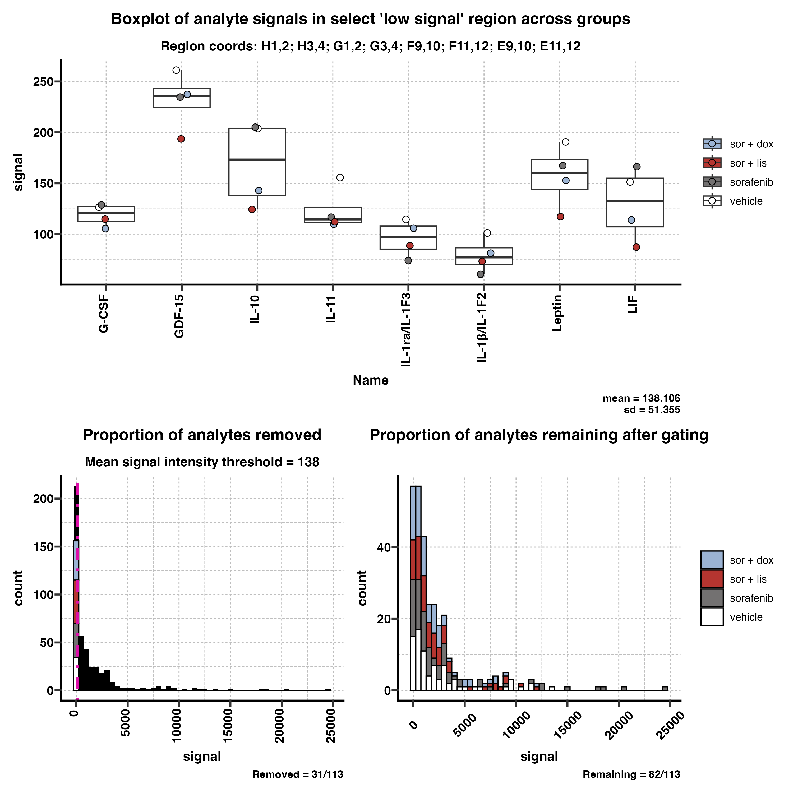
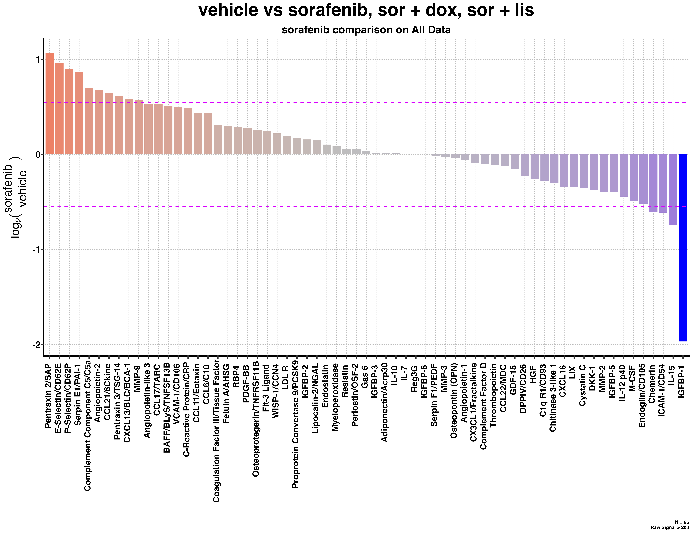
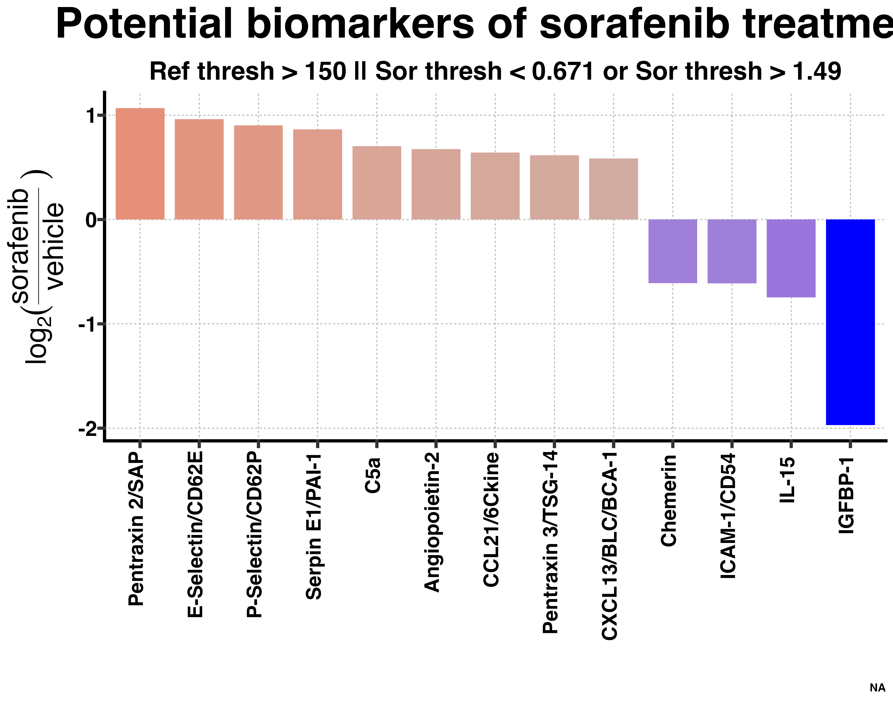
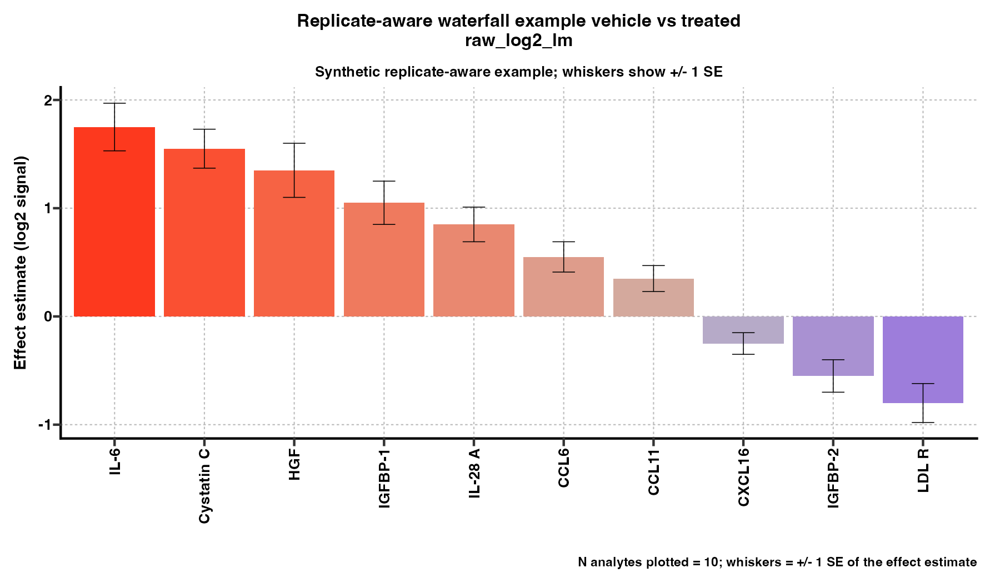
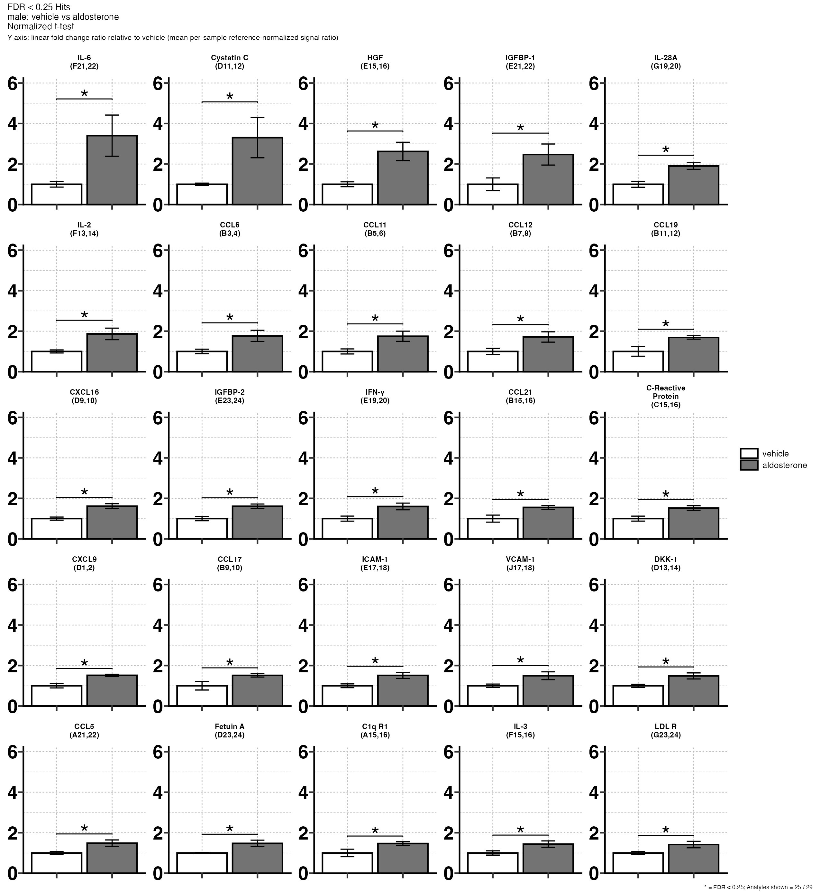

# Docs

This folder holds repo-local output examples that can be embedded directly in the documentation.

## Embedded Output Examples

Legacy exploratory examples show rendered outputs from the no-biological-replicate workflow. Replicate-aware examples use synthetic values so collaborator data are not embedded in the repository docs. These are example outputs, not defaults for a new project.

## Legacy Exploratory Examples

### Threshold diagnostics

Source output type: `threshold_diagnostics/region_stats.png`

### Main analysis waterfall

Source output type: `main_analysis/.../all_comparisons/waterfalls/...png`

### Main analysis combined barplots

Source output type: `main_analysis/.../fold_change_hits/.../barplots/...png`

### Selected-analytes waterfall

Source output type: `select_analytes/<comparison_slug>/selected_waterfall.png`

Selected-analyte bargraphs are written as one PNG per configured analyte under `select_analytes/<comparison_slug>/selected_bargraphs/`.

## Replicate-Aware Examples

These examples use synthetic values so they show the current biological-replicate outputs without embedding collaborator data.

### Replicate-aware inferential waterfall

Source output type: `inferential_results/comparisons/<comparison_slug>/waterfall_plots/<method>/<method>_waterfall*.png`

All replicate-aware inferential waterfall methods show method-specific effect estimates with `+/- 1 SE` whiskers for each plotted analyte.

### Replicate-aware inferential barplot

Source output type: `inferential_results/comparisons/<comparison_slug>/barplots/<method>/significant_hits/fdr_lt_0_25/<method>_barplot_fdr_lt_0_25_page_<n>.png`

This example shows fixed-size analyte title strips, ratio-scale `+/- 1 SE` whiskers on treatment fold-change bars, bracketed `*` annotations, a page caption defining the significance threshold, and fixed y-axis limits within the barplot set.

### Replicate-aware selected-analyte outputs

Source output types: `select_analytes/<comparison_slug>/<method>/selected_results.tsv`, `select_analytes/<comparison_slug>/<method>/selected_analyte_qc.tsv`, `select_analytes/<comparison_slug>/<method>/selected_waterfall.png`, and `select_analytes/<comparison_slug>/<method>/selected_bargraphs/<Analyte>.png`.

For the broader explanation of what each output means and where it is generated, see the root [README.md](../README.md).

## Method Notes

- [Worked Example: `raw_log2_lm` vs `normalized_t_test`](method-comparison-worked-example.md)
